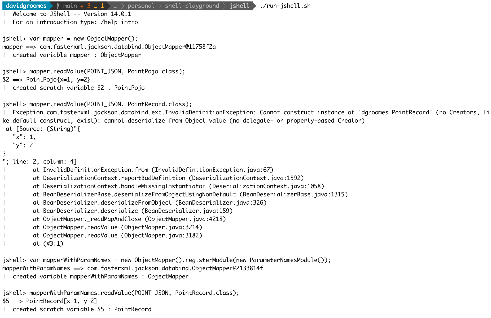

# with-libraries

This sub-project is similar to the `basic/` sub-project buts adds a few external Java libraries (including [Jackson](https://github.com/FasterXML/jackson)).

### Instructions

Note: this project was developed on macOS.

1. Use Java 15
1. Execute `./build.sh` to compile the source code
1. Execute `./run-main.sh` to run the program (i.e. the `main` method). But... this isn't what we really want. We want
   to use `jshell`! See the next step.
1. Execute `./run-jshell.sh` to start a `jshell` session which loads the library and application source code
1. Explore!
    * The `jshell` session will be pre-loaded with some convenience imports so you can get busy experimenting with `ObjectMapper`
      and the custom classes `PointPojo` and `PointRecord`.
    * For example, trying `new`-ing up an instance of `ObjectMapper`:
      * `var mapper = new ObjectMapper()`
    * Then, try de-serializing the JSON string stored in the `POINT_JSON` variable into an instance of `PointPojo`. Do so with:
      * `mapper.readValue(POINT_JSON, PointPojo.class)`
    * Below is a screenshot of an example interactive session:
      
